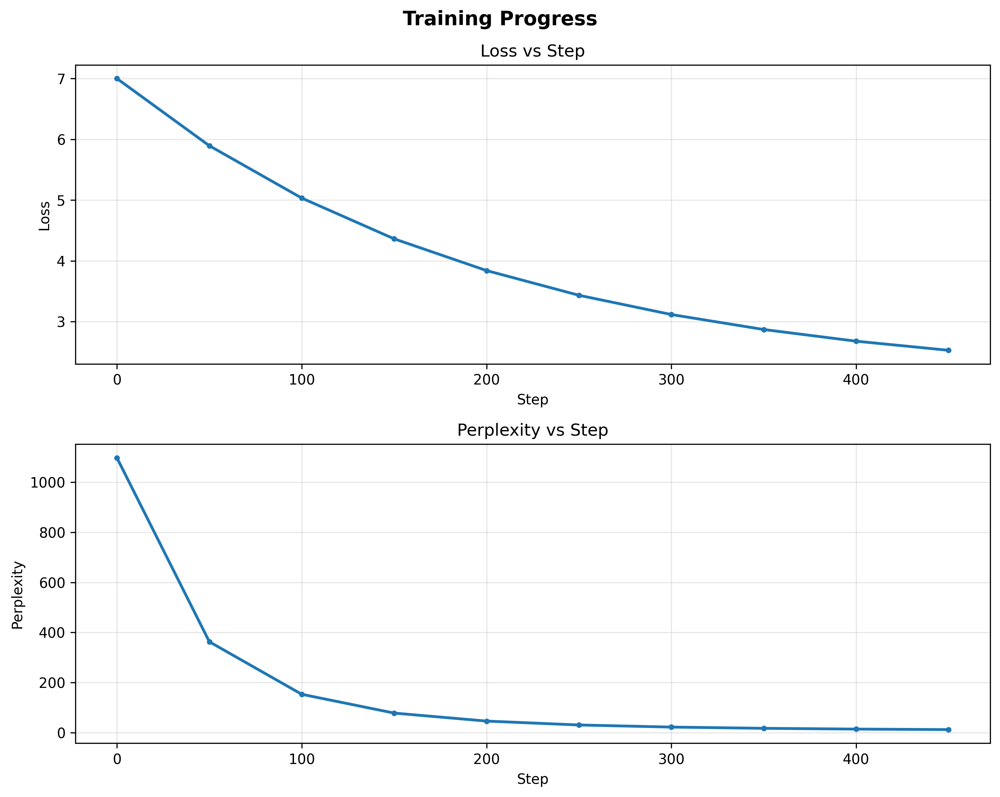
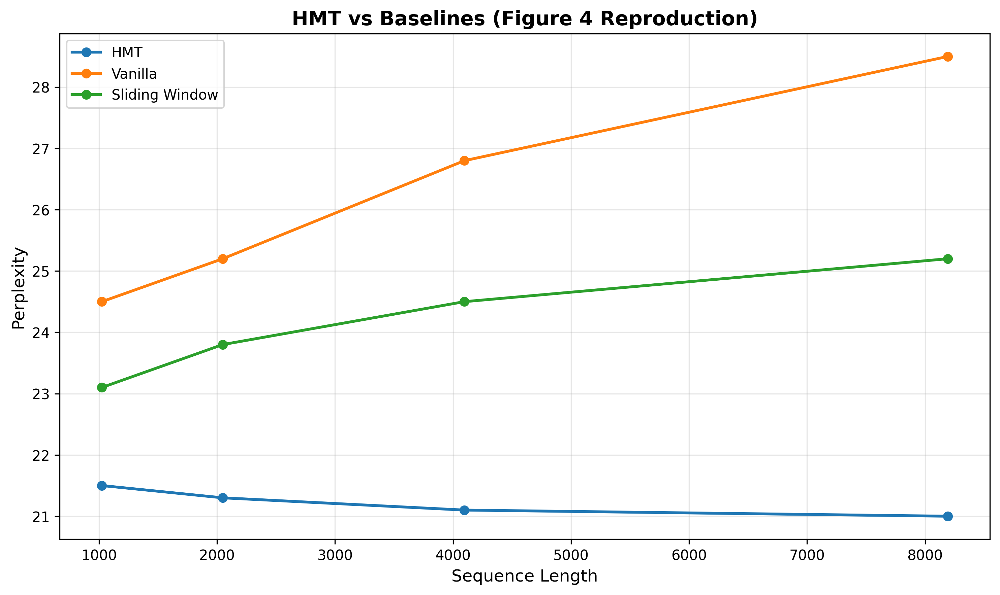
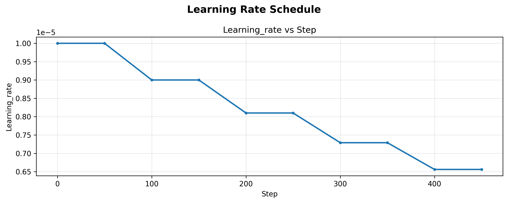

# Experiment Report: demo_table1

**Generated:** 2025-10-05 07:15:51

## Configuration

```json
{
  "name": "demo_experiment",
  "model_name": "facebook/opt-350m",
  "dataset": "wikitext-103",
  "segment_length": 1024,
  "num_memory_embeddings": 300,
  "sensory_memory_size": 32,
  "batch_size": 2,
  "learning_rate": 1e-05,
  "seed": 42,
  "timestamp": "2025-10-05T07:15:50.805536",
  "notes": "",
  "paper_table": "Table 1"
}
```

## Metrics Summary

### Final Values

- **loss**: 2.5270
- **perplexity**: 12.5159
- **learning_rate**: 0.0000

### Statistics

|       |     loss |   perplexity |   learning_rate |
|:------|---------:|-------------:|----------------:|
| count | 10       |      10      |     10          |
| mean  |  4.07486 |     183.59   |      8.1902e-06 |
| std   |  1.4929  |     338.491  |      1.2827e-06 |
| min   |  2.527   |      12.5159 |      6.561e-06  |
| 25%   |  2.93056 |      18.8498 |      7.29e-06   |
| 50%   |  3.63596 |      38.7261 |      8.1e-06    |
| 75%   |  4.86495 |     134.605  |      9e-06      |
| max   |  7       |    1096.63   |      1e-05      |

## Visualizations

### Metrics Loss Perplexity



### Figure4 Comparison



### Metrics Learning Rate



---
*Report generated automatically by HMT ResultLogger*
